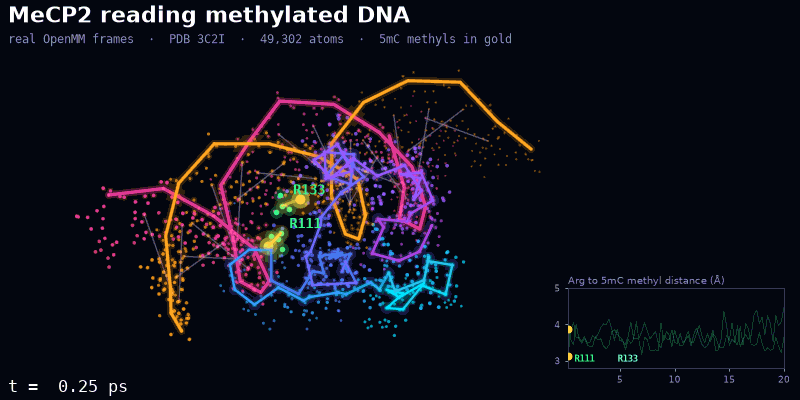

# NeuroTraj

**Watch a protein read DNA methylation, one frame at a time.**

<p align="center">
  
</p>

<p align="center"><sub>
Real frames from an OpenMM simulation run with this library. MeCP2 (blue to violet) sits on a 20 nucleotide DNA duplex (pink and orange strands) from PDB 3C2I.
Arg111 and Arg133 (green) each hold a 5-methylcytosine methyl group (gold) for the whole run, flexing between about 3.1 and 4.5 Å.
The coordinates are not smoothed or exaggerated. Only the camera spin, trails and glow are added. The run is 20 ps of a short pilot, so it shows the method working, not a converged result.
</sub></p>

NeuroTraj is a Python library for measuring how proteins touch DNA, in crystal
structures and in molecular dynamics trajectories. The first target is MeCP2, the
protein behind Rett syndrome, which recognises methylated CpG sites in neuronal
DNA. The Python package is called `neurodna`.

It answers questions like these.

- Which protein residues touch which nucleotides, and how closely?
- Does anything actually reach the methyl group of a 5-methylcytosine?
- Across a trajectory, how often is each contact present, and for how long at a stretch?
- Did the protein stay folded, and which parts moved the most?

Every answer comes back as a tidy pandas table that records its own units,
cutoff, periodic box handling and sampling, so a result can be traced back to
exactly how it was computed.

## Contents

- [Why it exists](#why-it-exists)
- [What it is made of](#what-it-is-made-of)
- [Install](#install)
- [Quick start](#quick-start)
- [Command line tools](#command-line-tools)
- [Units and output tables](#units-and-output-tables)
- [Design rules](#design-rules)
- [Running simulations with OpenMM](#running-simulations-with-openmm)
- [Examples](#examples)
- [Project layout](#project-layout)
- [Development](#development)
- [Limitations](#limitations)
- [Roadmap](#roadmap)
- [License](#license)

## Why it exists

Analysing a protein DNA complex looks easy until it quietly goes wrong. Most
scripts break silently in a few ways.

- Residues are identified by number alone, so chain B residue 12 and chain C residue 12 get merged.
- The MDAnalysis `nucleic` keyword skips modified bases such as 5-methylcytosine (`5CM`), so the methylated site simply vanishes from the analysis.
- Crystal lattices get treated as periodic MD boxes, which produces wrong distances.
- Molecules split across the periodic boundary give nonsense RMSD values.
- "Contact lifetimes" get reported without saying that the first and last runs were cut off by the edges of the simulation.

NeuroTraj refuses to guess. Ambiguous residues, incomplete selections,
unregistered residue names and broken molecules all raise clear errors instead
of producing numbers that look plausible and are wrong.

## What it is made of

| Layer | Built with | Role |
|---|---|---|
| Structure and trajectory I/O | MDAnalysis 2.7 or newer | Reads PDB, mmCIF, GROMACS, AMBER, CHARMM and NAMD files, and runs neighbour searches |
| Numerics | NumPy 1.24 or newer | Distances in float64, least squares superposition, periodic minimum image vectors |
| Results | pandas 2.0 or newer | Every result is a DataFrame with provenance stored in `DataFrame.attrs` |
| Plots (optional) | matplotlib 3.7 or newer | Contact maps and occupancy charts |
| Simulation (optional) | OpenMM 8.1 or newer with CHARMM36 (July 2024) | System preparation, minimisation, equilibration and production MD, including the 5-methylcytosine patch `5MC2` |
| Data | RCSB Protein Data Bank | Structures fetched on request with checksum pinning |
| Quality | pytest, strict mypy, ruff, GitHub Actions | 183 tests on Python 3.10 to 3.13, including the oldest supported dependency versions |

The library itself is pure Python with fully typed code (`py.typed`), no
compiled extensions and no network access on import.

## Install

NeuroTraj needs Python 3.10 or newer.

```bash
gh repo clone MaherHarp/NeuroTraj
cd NeuroTraj
python -m venv .venv
source .venv/bin/activate
pip install -e ".[plot]"
```

Optional extras

| Extra | Adds |
|---|---|
| `plot` | matplotlib plotting helpers |
| `md` | the OpenMM simulation workflow and the `neurodna-md` command |
| `test` | pytest and matplotlib, enough to run the test suite |
| `dev` | everything in `test` plus mypy, pandas stubs, ruff, build and twine |

## Quick start

### A static crystal structure

```python
from neurodna import Complex

cx = Complex.load("complex.pdb", protein="protein", dna="chainID B C")

cx.dna_residues()                                   # includes 5CM, flagged with modification "5mC"
[s.annotated_sequence for s in cx.dna_strands()]    # sequences such as "GGA[5mC]GGT"
cx.cpg_steps()                                      # CpG and methylated CpG steps, 5' to 3'
cx.contacts()                                       # residue to nucleotide contacts within 4.5 Å
cx.min_distances(max_distance=8.0)                  # closest heavy atom distance for each pair
cx.contacts(target="modification_markers", level="atom")  # who touches the 5mC methyl
```

### A molecular dynamics trajectory

Molecules must be made whole first (see [whole molecules](#rmsd-and-rmsf-need-whole-molecules)).

```python
from neurodna import Complex

md = Complex.load("system.tpr", "production_whole.xtc",
                  protein="segid PROA", dna="segid DNAA DNAB")

md.min_distances()        # per frame table with frame, time_ps, residue keys and min_distance_A
md.contact_occupancy()    # fraction of analysed frames in contact
md.contact_episodes()     # every continuous run of contact, with censoring and time brackets
md.backbone_rmsd()        # aligned on backbone N CA C O
md.rmsf()                 # per atom RMSF of protein heavy atoms
```

### Plotting

```python
from neurodna.plotting import plot_contact_occupancy

plot_contact_occupancy(md.contact_occupancy(), top=20)
```

## Command line tools

| Command | What it does |
|---|---|
| `neurodna-fetch` | Downloads a PDB entry into a checksummed local cache |
| `neurodna-md` | Runs the OpenMM workflow (`assess`, `prepare`, `run`, `analyze`, `derive-unmethylated`, `import-external`) |

### Getting structures

Nothing is ever downloaded on import or by the test suite. Downloads only
happen when you ask for them.

```bash
neurodna-fetch 3C2I --sha256 f96ee9192eabe5eafc50ff0b161c51275ad6ad8f03a2c0d0e447f18a820ed7bf
```

`neurodna.fetch.fetch_pdb()` does the same from Python.

- Files are stored in `~/.cache/neurodna/pdb/`. Override this with `--cache-dir` or the `NEURODNA_CACHE_DIR` environment variable.
- Each file gets a JSON sidecar with the source URL, UTC retrieval time, SHA-256, size and HTTP headers.
- Cached files are checked again every time they are used.
- If a pinned checksum stops matching, for example after an RCSB remediation, the download stops instead of silently replacing the file.

`neurodna.pdbheader.read_pdb_header()` reads the header records you need to
check an entry before analysing it.

- COMPND, DBREF and SEQADV for molecules, sequence mapping and engineered changes
- MODRES and HETNAM for modified residues
- REMARK 465 and 470 for missing residues and atoms
- REMARK 350 for biological assemblies

## Units and output tables

Lengths are in ångströms (Å) and times in picoseconds (ps). These are the
native MDAnalysis units and nothing is converted. GROMACS stores nanometres, but
MDAnalysis converts them to Å when reading, so a 0.4 nm cutoff is written as
`cutoff=4.0`.

Column names carry their unit, as in `min_distance_A`, `time_ps`, `rmsd_A` and
`observed_duration_ps`. Every table also records its units, cutoff, periodic box
use, and the frames and sampling intervals analysed in `DataFrame.attrs`.

## Design rules

### Residue identity

A residue is identified by `ResidueKey(segid, chain, resnum, icode, resname)`,
never by its number alone. Every output table carries all five fields plus a
readable label. Loading fails with `AmbiguousResidueError` in any of these cases.

- Two selected residues share a key.
- One MDAnalysis residue mixes several chain IDs.
- A residue has several alternate locations.

The mixed chain case matters because MDAnalysis groups residues by segment and
number, so neighbouring chains that share a segid get merged.

### Explicit selections

Both the protein and the DNA selection are required. Each is checked for bad
syntax, emptiness, overlap (at the atom and the residue level) and completeness.

Completeness means that nucleotide-like residues left out of the DNA selection,
but sharing its chain or segment, raise `IncompleteSelectionError`. This
catches the MDAnalysis `nucleic` keyword, which does not match `5CM`. Use chain
or segment based DNA selections instead, or pass `allow_partial_dna=True` if
leaving residues out is intentional.

### Modified residues

Residue names are looked up in explicit registries, `default_dna_registry()`
and `default_protein_registry()`. An unregistered name raises
`UnsupportedResidueError` listing the residues, so nothing is dropped silently.

A modified residue must declare marker atoms. For 5CM that is the methyl carbon
`C5A`. If the markers are missing, identity is ambiguous and loading fails. DNA
residues carrying an O2′ atom are rejected as RNA.

To add other modifications or other atom naming, register them.

```python
from neurodna import Complex, ResidueSpec, default_dna_registry

reg = default_dna_registry()
reg.register(ResidueSpec("5HC", parent="DC", one_letter="C",
                         modification="5hmC", marker_atoms=("C5A", "O5A")))  # use your file's atom names
cx = Complex.load("complex.pdb", protein="protein", dna="chainID B C", dna_registry=reg)
```

### Static structures, ensembles and trajectories

Every complex has a `FrameKind`, and each kind allows a different set of analyses.

| Input | Kind | Allowed |
|---|---|---|
| One frame | `STATIC` | `contacts`, `min_distances`, sequences |
| Multi model file such as an NMR PDB, or `time_ordered=False` | `ENSEMBLE` | the above per model, plus `ensemble_contact_frequency` and `backbone_rmsd` per model |
| Topology plus trajectory files | `TRAJECTORY` | the above per frame, plus `contact_occupancy`, `contact_episodes`, `backbone_rmsd`, `rmsf` and `frame_times` |

Time resolved methods raise `DynamicsUnavailableError` on static structures and
ensembles. Frame times come from the file and must strictly increase, otherwise
`TrajectoryError` is raised. If the format has no time information, times are
reported as NaN rather than the 1 ps steps MDAnalysis would invent, unless you
pass `timestep_ps`.

### Geometric contacts between heavy atoms

A residue and a nucleotide are in contact when their minimum heavy atom distance
is at most the cutoff (4.5 Å by default, inclusive). This is a geometric test,
not a hydrogen bond, salt bridge or binding energy.

Heavy atoms come from the topology's element records, cross checked against
standard atom names. `AmbiguousElementError` is raised for atoms whose element
contradicts their name (a cysteine `HG` marked as mercury), whose element is
invalid, or that have no element and a non standard name, such as virtual sites.

Candidate pairs are found by MDAnalysis, then their distances are recomputed in
float64 before the cutoff test. A pair exactly at the cutoff is therefore
classified the same way whichever search method MDAnalysis picks.

### Periodic boundaries

With the default `pbc=None`, distances use the minimum image convention in every
frame that has a valid periodic box. A box is valid when all of these hold.

- All lengths are positive and all angles are between 0° and 180°.
- It is not a crystallographic cell. A PDB `CRYST1` space group other than `P 1`, as in the 3C2I crystal structure, describes a lattice, not an MD box.
- No rotational fitting transformation is attached to the trajectory.

The smallest perpendicular box width must be at least twice the cutoff.
Analyses refuse to mix frames with and without a box. `pbc=True` requires a box
in every frame, and `pbc=False` never uses one.

### Frames, times and sampling

Distances are computed frame by frame from the raw coordinates. Real trajectory
times are kept in `time_ps`, and each table records `sampling_interval_ps`, the
smallest and largest intervals, whether sampling is uniform, and the frame step.

Occupancy counts frames, so it is a fraction of time only when sampling is
uniform. Contact episodes need times and raise `TimingUnavailableError` when the
trajectory has none, unless `timestep_ps` is given.

### Contact episodes

`contact_episodes()` reports every maximal run of consecutive analysed frames in
contact, one row per run.

- `first_frame`, `last_frame` and `n_frames`
- `first_time_ps` and `last_time_ps`
- `preceding_time_ps` and `following_time_ps`, the neighbouring frames without contact
- `observed_duration_ps` as a lower bound and `max_duration_ps` as an upper bound
- `left_censored` and `right_censored`, set when the run touches the start or end of the analysed window

Formation and breaking times are only known to within the sampling interval, and
breaks shorter than it are invisible. These are durations of individual residue
to nucleotide geometric contacts, **not protein DNA binding residence times**.

### RMSD and RMSF

Each frame is superposed onto `reference_frame` (frame 0 by default) with an
unweighted least squares Kabsch fit of the alignment selection. By default that
is the protein backbone, `align="name N CA C O"`, evaluated inside the protein
heavy atoms, so DNA, solvent and hydrogens can never enter the fit.

`backbone_rmsd()` measures the backbone. `rmsf(atoms="all")` gives the RMSF of
each protein heavy atom around its mean aligned position. Superposition works on
copies, so the universe coordinates, and every distance, are never changed.

### RMSD and RMSF need whole molecules

NeuroTraj never unwraps coordinates. Each analysed frame is checked, and
`WrappedStructureError` is raised in any of these cases.

- A bond is split across the boundary, stretched, or broken. Topology bonds are used, or backbone bonds if the topology has none.
- An atom lies more than 12 Å from its residue's CA.
- The chains of a multi chain protein sit in different periodic images.

Backbone bonds that are already long in the reference frame are treated as real
chain gaps and listed in `attrs["chain_gaps"]`. Prepare trajectories first with
one of these.

- GROMACS, using `gmx trjconv -pbc mol -center`, then `-pbc nojump` (or `-pbc cluster` for complexes)
- MDAnalysis, using the `unwrap` and `nojump` transformations without rotational fitting
- CPPTRAJ, using `autoimage` or `unwrap`

## Running simulations with OpenMM

`pip install -e ".[md]"` adds `neurodna-md`, which runs four steps.

1. **Assess** whether the structure can be prepared with documented force field parameters, listing blockers, required decisions and caveats.
2. **Prepare** the system with CHARMM36 (July 2024), including the documented 5-methylcytosine DNA patch `5MC2`, with every conversion and added atom recorded.
3. **Run** minimisation, restrained equilibration and production, with seeds, checkpoints and resume.
4. **Analyse** the production trajectory with NeuroTraj.

`neurodna-md derive-unmethylated` builds the matching unmethylated control by
deleting the 5-methyl groups, and `neurodna-md import-external` accepts an
OpenMM system prepared elsewhere. Trajectories from other engines go straight to
`Complex.load`.

OpenMM is never imported unless one of these steps is used. Its integration
tests are opt in with `pytest -m openmm`.

The simulation in the animation above is the 3C2I micro pilot. It has 49,302
atoms, ran 5 ps of equilibration and 20 ps of production on 6 CPU threads at
about 0.9 ns per day, and was checked for stability. It is far too short to say
anything scientific about MeCP2. See the
[MD README](examples/mecp2_3c2i/md/README.md) and the
[pilot analysis](examples/mecp2_3c2i/md/pilot_analysis_report.md) for the
preparation choices, measured compute and limitations. Before running anything
expensive, read the [experiment design](docs/experiment_design.md), which covers
the planned methylated versus unmethylated comparison, replicates,
preregistered analyses, QC, and compute and storage estimates.

## Examples

| Example | What it shows |
|---|---|
| [`examples/mecp2_3c2i/`](examples/mecp2_3c2i/) | A verified static analysis of PDB 3C2I, the MeCP2 methyl binding domain bound to methylated BDNF DNA. It exports contact tables, a contact map and a provenance file. The [tutorial](examples/mecp2_3c2i/TUTORIAL.md) explains the motivation, what the measurements mean and what they cannot establish. |
| [`examples/mecp2_3c2i/md/`](examples/mecp2_3c2i/md/) | The OpenMM workflow on 3C2I, from force field assessment to pilot analysis, with configs for the next stage on a laptop and on a GPU. |
| [`examples/synthetic_temporal_demo.py`](examples/synthetic_temporal_demo.py) | Occupancy and contact episodes on a clearly labelled synthetic toy system. |

```bash
python examples/mecp2_3c2i/run_example.py
python examples/synthetic_temporal_demo.py
```

Crystal structures are never turned into fake trajectories, and synthetic data
is always labelled as synthetic.

## Project layout

```text
src/neurodna/
    complex.py        Complex, the main entry point
    residues.py       ResidueKey and the residue registries
    structure.py      selection checks, whole molecule checks, RMSD and RMSF
    interactions.py   contacts, distances, occupancy and episodes
    frames.py         static, ensemble and trajectory frame handling
    geometry.py       periodic box handling and minimum image distances
    elements.py       heavy atom classification
    fetch.py          PDB downloads with checksums (neurodna-fetch)
    pdbheader.py      PDB header records
    plotting.py       optional matplotlib plots
    errors.py         the exception hierarchy
    md/               optional OpenMM workflow (neurodna-md)
tests/                183 tests, synthetic fixtures plus the real 3C2I structure
examples/             worked analyses and simulation configs
docs/                 experiment design and the script that renders the animation
```

## Development

```bash
pip install -e ".[dev]"
pytest                          # the test suite, OpenMM tests are opt in with pytest -m openmm
mypy                            # strict type checking of src/neurodna
ruff check src tests examples docs
python -m build                 # sdist and wheel in dist/, the sdist includes the tests
```

The version is defined once, in `src/neurodna/__init__.py`, and changes are
recorded in the [changelog](CHANGELOG.md). Continuous integration runs the tests
on Python 3.10 to 3.13 and at the oldest supported dependency versions, along
with the OpenMM integration tests, mypy, ruff, and the test suite from the built
sdist.

The animation is rendered by `python docs/make_readme_gif.py` from the micro
pilot trajectory, which is too large to keep in the repository.

## Limitations

- Contacts are distance cutoffs only, with no hydrogen bond angles, groove (major or minor) assignment or energies.
- Heavy atom identification needs either element records or standard H, C, N, O, S and P atom names. Other atoms without elements are rejected, not guessed.
- DNA moiety labels (phosphate, sugar, base) and protein backbone and side chain labels are based on atom names.
- The default registries cover PDB, AMBER and CHARMM names and `5CM` only. 5hmC, 5fC and 5caC names vary between sources and must be registered. Single letter `A`, `C` and `G` names are not accepted as DNA.
- Whole molecule checks are heuristics based on bonds, residue extent (12 Å) and chain centroids moving by less than half the box. Without a box, only changes relative to the reference frame can be detected.
- RMSD and RMSF use one fixed reference frame, not iterative averaging, with no mass weighting, for protein atoms only.
- Episodes have no gap tolerance, so a single frame out of contact splits an episode. They are not reweighted for non uniform sampling.
- `min_distances(max_distance=None)` builds every pair in every frame and can be large.
- Numerical tests use small, clearly labelled synthetic fixtures. The only real structure tested is PDB 3C2I, and the only real trajectory so far is the 25 ps micro pilot.

## Roadmap

- Production length, replicated simulations of methylated and unmethylated 3C2I, following the preregistered [experiment design](docs/experiment_design.md)
- Hydrogen bond and water bridge analysis with angle criteria
- Major and minor groove assignment for contacts
- Registry entries for 5hmC, 5fC and 5caC once naming is pinned down
- Other methyl CpG binding proteins beyond MeCP2
- A release on PyPI

## License

MIT, see [LICENSE](LICENSE).
